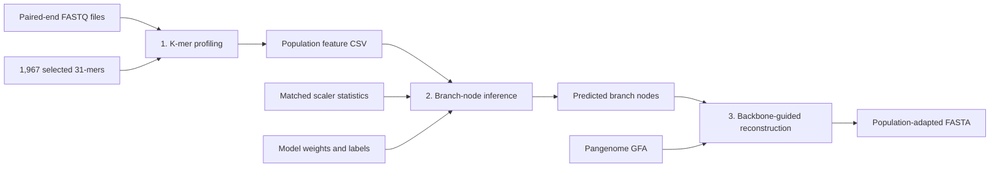

# PGpath: Pangenome Subpath-Based Recommendation of Population-Adapted Linear Reference Genomes

**PGpath** is a pangenome-based framework for generating population-adapted linear reference genomes. Given paired-end sequencing reads from a target population, PGpath extracts population-level k-mer frequency features, predicts branch-node selections in a pangenome graph, and reconstructs a linear reference genome from the selected pangenome subpath.

> The generated reference preserves population-relevant pangenome sequences while remaining compatible with standard linear-reference workflows, including read mapping and variant detection.

## Contents

- [1. Overview](#1-overview)
- [2. Repository Structure](#2-repository-structure)
- [3. Requirements](#3-requirements)
- [4. Direct Use with a Pretrained Model](#4-direct-use-with-a-pretrained-model)
- [5. Internal Workflow of `pgpath.py`](#5-internal-workflow-of-pgpathpy)
- [6. Model Retraining](#6-model-retraining)
- [7. Citation](#7-citation)

---

## 1. Overview

PGpath supports two main use cases:

- **Direct reference recommendation with a pretrained model**
  - Use `pgpath.py`.
  - Input: a folder containing paired-end FASTQ files.
  - Output: a PGpath-derived population-adapted FASTA reference.

- **Model retraining**
  - Start from `pgpath_train.py`.
  - Input: a prepared k-mer feature matrix, aligned branch-node labels, and branch-node topological relations.
  - Output: trained PGpath model weights (`.pth`). Export the selected k-mer list and scaler statistics separately with `pgpath_prepare_features.py` (Section 6.3).

This repository contains the main PGpath program. Ablation-study and supplementary-experiment workflows are not included here.

---

## 2. Repository Structure

```text
PGpath/
|-- pgpath.py
|-- pgpath_prepare_features.py
|-- pgpath_infer.py
|-- pgpath_reconstruct.py
|-- pgpath_train.py
|-- pgpath_kmer_profile.py
|-- pgpath_selected_kmers.txt
|-- pgpath_scaler_stats.csv
|-- features_rigorous_filtered_1967.csv
|-- trained_model.pth
|-- labels.csv
|-- label_relations.csv
`-- pangenome_graph_default.gfa
```

### 2.1 Core Scripts

| Script | Function |
| --- | --- |
| `pgpath.py` | One-command PGpath pipeline for direct use. |
| `pgpath_kmer_profile.py` | Counts selected k-mers from paired-end FASTQ files and builds population-level k-mer frequency features. |
| `pgpath_infer.py` | Predicts branch-node labels using a trained PGpath model. |
| `pgpath_reconstruct.py` | Reconstructs a PGpath-derived linear FASTA reference from predicted branch-node labels and a GFA graph. |
| `pgpath_train.py` | Trains the topology-aware multi-task branch-node prediction model. |
| `pgpath_prepare_features.py` | Exports selected k-mers and StandardScaler statistics from a training feature matrix. |

### 2.2 Default Resource Files

For **direct use**, the following resource files should be placed in the same directory as `pgpath.py`:

| File | Description |
| --- | --- |
| `pgpath_selected_kmers.txt` | Selected list of 1,967 31-mers used by PGpath, one k-mer per line. |
| `pgpath_scaler_stats.csv` | StandardScaler statistics for the same 1,967 k-mers. The file has 1,967 data rows and is in exactly the same order as `pgpath_selected_kmers.txt`. |
| `trained_model.pth` | Trained PGpath model weights. |
| `labels.csv` | Branch-node label file used to rebuild label mappings during inference. |
| `pangenome_graph_default.gfa` | Pangenome graph used for reference reconstruction, constructed from five reference genomes: T2T-CHM13, GRCh38, HG002, T2T-YAO, and NA19240. |

**Download links for large files:**

| File | Link |
| --- | --- |
| `pangenome_graph_default.gfa` | [Download GFA file](https://1860581393.share.123pan.cn/123pan/B1c5vd-HCIe3) |
| `labels.csv` | [Download label matrix](https://1860581393.share.123pan.cn/123pan/B1c5vd-Zl1e3) |
| `trained_model.pth` | [Download trained model](https://1860581393.share.123pan.cn/123pan/B1c5vd-j89L3) |

After downloading, place the resource files in the PGpath project directory or specify their locations using the corresponding command-line arguments.

> **Resource compatibility:** `pgpath_selected_kmers.txt`, `pgpath_scaler_stats.csv`, `trained_model.pth`, and `labels.csv` form one compatible inference resource set. Do not mix files exported or trained from different feature sets. PGpath checks the selected k-mer/scaler pairing and model dimensions before prediction.

---

## 3. Requirements

### 3.1 Python Dependencies

PGpath requires **Python 3.9 or later**. Install the required Python packages:

```bash
pip install numpy pandas scipy scikit-learn torch
```

Optionally verify the installation:

```bash
python -c "import numpy, pandas, scipy, sklearn, torch; print('Python dependencies OK')"
```

### 3.2 Jellyfish

PGpath uses **Jellyfish** for k-mer counting. Install Jellyfish with Conda:

```bash
conda install -c bioconda jellyfish
```

Alternatively, install Jellyfish with `apt`:

```bash
sudo apt-get install jellyfish
```

Check whether Jellyfish is available:

```bash
jellyfish --version
```

If Jellyfish is not on `PATH`, provide the executable explicitly with `--jellyfish /path/to/jellyfish`.

---

## 4. Direct Use with a Pretrained Model

### 4.1 Required Arguments

Before the first run, confirm that:

- each sample has both an R1 file and an R2 file;
- the five default inference resource files listed in Section 2.2 are available;
- `pgpath_selected_kmers.txt` and `pgpath_scaler_stats.csv` both contain 1,967 k-mers in the same order; and
- the output directory and the temporary filesystem have sufficient free space.

For most users, only two arguments are required:

```bash
python pgpath.py \
  -i /path/to/fastq_folder \
  -o PGpath_based_reference.fasta
```

Full command with explicit resources:

```bash
python pgpath.py \
  -i /path/to/fastq_folder \
  -o PGpath_based_reference.fasta \
  -k pgpath_selected_kmers.txt \
  --scaler-stats pgpath_scaler_stats.csv \
  -m trained_model.pth \
  -l labels.csv \
  -g pangenome_graph_default.gfa \
  -n new_population \
  --threads 16 \
  --hash-size 1G \
  --device auto \
  --temp-dir /path/to/temp_folder \
  --chrom-name-style chm13
```

| Short option | Long option | Requirement or default | Description |
| --- | --- | --- | --- |
| `-i` | `--input-dir` | Required | Directory containing paired-end FASTQ files from the target population. |
| `-o` | `--output` | Required | Output FASTA file for the PGpath-derived population-adapted linear reference genome. |
| `-k` | `--kmers` | `pgpath_selected_kmers.txt` | Text file containing the 1,967 selected PGpath k-mers, one k-mer per line. |
| - | `--scaler-stats` | `pgpath_scaler_stats.csv` | CSV file containing the 1,967 matched StandardScaler statistics. These statistics ensure that new population k-mer features are normalized consistently with model training. |
| `-m` | `--model` | `trained_model.pth` | Trained PGpath model weights used for branch-node prediction. |
| `-l` | `--labels` | `labels.csv` | Branch-node label file used to rebuild the mapping between model output classes and original pangenome graph node IDs. |
| `-g` | `--gfa` | `pangenome_graph_default.gfa` | Input pangenome graph in GFA format. PGpath reconstructs the final linear reference from this graph and the predicted branch-node labels. |
| `-n` | `--population-name` | `new_population` | Population name used as the row identifier in intermediate feature and prediction files. |
| - | `--threads` | `16` | Number of threads used by Jellyfish for k-mer counting. |
| - | `--hash-size` | `1G` | Jellyfish hash size for k-mer counting. Increase this value for large sequencing datasets if needed. |
| - | `--device` | `auto` | Device used for neural network inference: `auto`, `cpu`, or `cuda`. With `auto`, PGpath uses CUDA if available, otherwise CPU. |
| - | `--temp-dir` | System temporary directory | Parent directory used to create run-specific Jellyfish databases. Use a filesystem with sufficient free space for large sequencing datasets. |
| - | `--chrom-name-style` | `chm13` | Chromosome naming style for the output FASTA. Use `chm13` to convert known T2T-CHM13 RefSeq accessions such as `NC_060925.1` to `chr1`; use `as-is` to retain the GFA names. |

Useful additional options:

| Option | Purpose |
| --- | --- |
| `--recursive` | Search for FASTQ files in nested subdirectories. |
| `--jellyfish /path/to/jellyfish` | Use a Jellyfish executable that is not on `PATH`. |
| `--work-dir DIR` | Set the directory for intermediate feature and prediction CSV files. |
| `--keep-intermediate` | Retain the generated feature and prediction CSV files. |
| `--keep-temp` | Retain temporary Jellyfish databases for debugging. |
| `--save-sample-matrix FILE` | Save per-sample normalized k-mer frequencies. |
| `--skip-zero-count-samples` | Skip, rather than stop on, samples whose selected-k-mer total is zero. |
| `--hidden-dim N` | Set the model hidden dimension; it must match the setting used to train the model. |
| `--max-skip-bp N` | Limit the number of backbone bases that one alternative path may replace; default: 500,000. |
| `--max-alt-steps N` | Limit graph traversal steps for one alternative path; default: 1,000. |
| `--line-width N` | Set the FASTA sequence line width; default: 80. |
| `--chrom-map FILE` | Apply a custom CSV/TSV chromosome-name mapping after the selected naming style. |
| `--allow-unmapped-chroms` | Keep names absent from a requested chromosome mapping instead of raising an error. |

Run `python pgpath.py --help` to see all current options and defaults.

When the GFA backbone uses T2T-CHM13 RefSeq accessions, PGpath can convert chromosome names such as `NC_060925.1` to `chr1` in the output FASTA.

Default behavior:

```bash
python pgpath.py \
  -i /path/to/fastq_folder \
  -o PGpath_based_reference.fasta \
  --chrom-name-style chm13
```

Keep chromosome names exactly as stored in the GFA file:

```bash
python pgpath.py \
  -i /path/to/fastq_folder \
  -o PGpath_based_reference.fasta \
  --chrom-name-style as-is
```

Use a custom chromosome-name mapping file:

```bash
python pgpath.py \
  -i /path/to/fastq_folder \
  -o PGpath_based_reference.fasta \
  --chrom-map chrom_name_map.csv
```

The mapping file should contain `source` and `target` columns. If these column names are not available, PGpath uses the first two columns as source and target names:

```csv
source,target
NC_060925.1,chr1
NC_060926.1,chr2
NC_060927.1,chr3
```

### 4.2 Supported FASTQ File Extensions

A folder may contain multiple paired-end samples:

```text
sample1_R1.fastq.gz
sample1_R2.fastq.gz
sample2_R1.fastq.gz
sample2_R2.fastq.gz
sample3_R1.fastq.gz
sample3_R2.fastq.gz
```

PGpath recognizes the following FASTQ file extensions:

```text
.fastq.gz
.fq.gz
.fastq
.fq
```

PGpath identifies paired-end samples from file names. The mate identifier must be clearly separated from the sample name by `_`, `-`, or `.`.

Supported examples:

```text
sample1_R1.fastq.gz
sample1_R2.fastq.gz
sample1_1.fq.gz
sample1_2.fq.gz
sample1-L001-R1-001.fastq.gz
sample1-L001-R2-001.fastq.gz
sample1_L001_R1_001.fastq.gz
sample1_L001_R2_001.fastq.gz
sample1_L002_R1_001.fastq.gz
sample1_L002_R2_001.fastq.gz
```

Lane-split files that resolve to the same sample name are grouped together. Files with unrecognized mate naming and samples missing either R1 or R2 are reported and ignored. If no complete pair is found, PGpath stops with an error.

By default, PGpath searches FASTQ files only in the provided folder. Use `--recursive` if FASTQ files are stored in nested subdirectories:

```bash
python pgpath.py \
  -i /path/to/fastq_folder \
  -o PGpath_based_reference.fasta \
  --recursive
```

### 4.3 Output Files

The main output is a FASTA file containing the PGpath-derived population-adapted linear reference genome. PGpath writes the FASTA atomically, so a reconstruction failure does not leave a partially written final file.

By default, generated feature and prediction CSV files are removed when the run ends, including when a later pipeline step fails. Use `--keep-intermediate` to retain them for inspection or debugging:

```bash
python pgpath.py \
  -i /path/to/fastq_folder \
  -o PGpath_based_reference.fasta \
  --keep-intermediate
```

Intermediate files include:

| File | Description |
| --- | --- |
| `new_population.features.csv` | One-row population-level normalized k-mer frequency vector containing the 1,967 selected k-mers. |
| `new_population.predicted_paths.csv` | Predicted branch-node labels for reference reconstruction. |

Use `--work-dir`, `--population-feature-output`, and `--prediction-output` to control intermediate paths. To keep these files after the run, also specify `--keep-intermediate`.

---

## 5. Internal Workflow of `pgpath.py`

The one-command pipeline performs three steps:



**Step 1: Population-Level k-mer Feature Construction**

`pgpath_kmer_profile.py` counts the 1,967 selected k-mers from each paired-end sample using Jellyfish. For each sample, selected k-mer counts are normalized by the total count of selected k-mers in that sample. Normalized sample-level vectors are averaged across all valid samples.

The resulting feature file has one row and preserves the selected k-mer order:

```csv
sample_id,kmer_1,kmer_2,kmer_3,...
new_population,0.00057,0.00054,0.00086,...
```

**Step 2: Branch-Node Inference**

`pgpath_infer.py` standardizes the population-level k-mer feature vector using `pgpath_scaler_stats.csv` and predicts branch-node labels with the trained PGpath model. Before prediction, the program validates feature names, numeric values, selected k-mer/scaler order, and model dimensions. Invalid padded output classes are masked before branch labels are decoded.

The prediction file has the following format:

```csv
Sample_ID,branch_1,branch_2,branch_3,...
new_population,s123,s456,s789,...
```

**Step 3: Reference Reconstruction**

`pgpath_reconstruct.py` traverses the ordered primary backbone nodes in the GFA graph and inserts a predicted non-backbone branch path only when it connects from the current backbone node and rejoins a downstream backbone node on the same chromosome. Unsafe alternatives, including cycles, ambiguous connections, missing sequences, upstream or cross-chromosome re-entry, and paths beyond the configured limits, fall back to the backbone path.

The final output is a linear FASTA reference.

---

## 6. Model Retraining

Use this section only when training a new PGpath model.

### 6.1 Data Partitioning

`pgpath_train.py` randomly splits the rows of the supplied feature matrix and their aligned labels into **60% training, 20% validation, and 20% test partitions by default**.

| Partition | Default share of input rows | Use in the current script |
| --- | --- | --- |
| Training | 60% | Used for model optimization. |
| Validation | 20% | Held out from optimization; no validation evaluation is performed. |
| Test | 20% | Held out from optimization; no test evaluation is performed. |

With the default settings, the script first holds out 40% of the input rows, then divides that held-out set equally into validation and test partitions. The feature-label pairing is preserved. The same seed and the same ordered input reproduce the partition membership. Actual counts may differ slightly from the requested percentages because sample counts must be integers; the script prints the resulting counts.

**Preprocessing behavior:** The script fits `StandardScaler` on the entire input feature matrix and builds label mappings before splitting the data. Therefore, the held-out rows are excluded from model optimization but still contribute to preprocessing. The current implementation should not be described as a strictly leakage-free validation/test workflow. A source-level evaluation with training-only preprocessing requires a separately implemented workflow.

### 6.2 Train a New PGpath Model

Required input files:

| File | Description |
| --- | --- |
| `features_rigorous_filtered_1967.csv` | Prepared input matrix containing the 1,967 selected k-mer features; rows are split internally into training, validation, and test partitions. |
| `labels.csv` | Branch-node label matrix with the same number of rows as the feature matrix and corresponding sample IDs. |
| `label_relations.csv` | Branch-node topological relations, with `source` and `target` columns containing node IDs. |

The first column of each feature/label CSV contains sample IDs. Keep rows paired correctly: when the same sample IDs appear in a different order, the script reorders the labels to match the feature matrix. If the ID sets differ but row counts match, it prints a warning and uses the existing row order.

Run:

```bash
python pgpath_train.py \
  -i features_rigorous_filtered_1967.csv \
  -l labels.csv \
  -r label_relations.csv \
  -o trained_model.pth \
  --epochs 500 \
  --batch-size 64 \
  --lambda-graph 1e-4 \
  --validation-size 0.2 \
  --test-size 0.2 \
  --seed 42 \
  --device auto
```

The split options are optional; omitting them gives the same default 60%/20%/20% split.

| Option | Default | Meaning |
| --- | --- | --- |
| `--validation-size` | `0.2` | Fraction of the entire input reserved for validation. |
| `--test-size` | `0.2` | Fraction of the entire input reserved for testing. |
| `--seed` | `42` | Random seed used for data splitting and training initialization. |

The requested training fraction is `1 - validation_size - test_size`. Both held-out fractions must be greater than 0 and less than 1, their sum must be less than 1, and the input must contain enough rows for all three partitions to be non-empty. Even an externally prepared training-only file is split again when passed to this script.

For example, an input containing 100 rows gives:

```text
Data split: train=60, validation=20, test=20
```

The default training configuration uses 500 epochs, batch size 64, hidden dimension 1,024, dropout 0.3, Adam learning rate `1e-3`, weight decay `1e-5`, topology-aware loss weight `1e-4`, and random seed 42.

The command above saves model weights to `trained_model.pth`. If `-o` is omitted, the script saves `pgpath_model_YYYYMMDD_HHMMSS.pth` in the current working directory. The `.pth` file contains the model state dictionary; it does not contain scaler statistics, label mappings, or data partitions.

### 6.3 Export Selected k-mers and Scaler Statistics

Export the selected k-mer list and scaler statistics from the **same complete feature matrix passed to `pgpath_train.py -i`**, preserving its feature columns and order. This matches the current training script, which fits its scaler before the internal split. Using only the internal 60% training subset can produce different preprocessing statistics.

```bash
python pgpath_prepare_features.py \
  -i features_rigorous_filtered_1967.csv \
  -k pgpath_selected_kmers.txt \
  -s pgpath_scaler_stats.csv
```

Generated files:

```text
pgpath_selected_kmers.txt
pgpath_scaler_stats.csv
```

The exporter uses the supplied feature columns as the selected k-mer list; it does not perform feature selection. For the 1,967-feature matrix above, the list and scaler CSV each contain 1,967 entries in the feature-column order.

Keep these files with the model trained from the same input. For inference, preserve the branch order and per-branch class mapping from the aligned labels used during training, and use the same model hidden dimension. Exporting matching scaler statistics reproduces the existing preprocessing; it does not change the evaluation limitations described in Section 6.1.

---

## 7. Citation

If you use PGpath in your work, please cite the corresponding PGpath manuscript.
